# Upload de l'application

## Création du dossier Web

Sur le serveur, créez un dossier `www` dans le répertoire de votre utilisateur
``` bash
mkdir www
cd ./<nom_du_projet>
```

Créez ensuite à l'intérieur un dossier portant le nom du projet
``` bash
cd ./www
mkdir <nom_du_projet>
```

Enfin à l'intérieur de ce nouveau dossier, créez-en 2 autres, un pour le front-end et un pour le back-end (Figure 1)
``` bash
cd ./<nom_du_projet>
mkdir front back
```

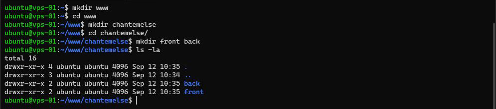
*Figure 1 : Contenu du dossier Web*

## Compilation du projet Angular

Sur votre PC, ouvrez un terminal et rendez-vous dans votre dossier de projet Angular (Figure 2)


*Figure 2 : Dossier du projet Angular*

Avant de lancer le build, veillez à bien avoir modifié l'URL de votre API dans le fichier `src/environments/environment.prod.ts`
``` ts{3}
export const environment = {
  production: true,
  apiUrl: 'http://' + document.location.hostname + ':8081/'
};
```

Compilez votre projet pour la production avec la commande
``` bash
ng build --prod
``` 

Par défaut Angular va compiler votre projet dans `/dist/<nom_du_projet>/` (Figure 3)


*Figure 3 : Contenu du projet compilé*

Ce sont ces fichiers que vous allez envoyer sur votre serveur

## Compilation du projet Spring Boot

Sur votre PC, ouvrez un terminal et rendez-vous dans votre dossier de projet Spring Boot (Figure 4)

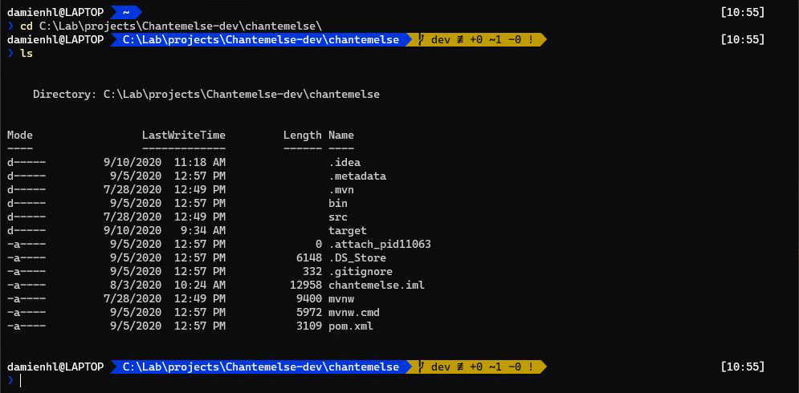
*Figure 4 : Dossier du projet Spring Boot*

Redéfinissez, si besoin, la configuration de l'application pour la production, notamment dans le fichier `application.properties` situé dans `src/main/resources`.
Assurez-vous que le port `server.port` sur lequel fonctionne Spring Boot est bien le même que celui défini dans votre fichier `environment.prod.ts` d'Angular. En l'occurrence ici, il s'agit du port 8081.

Compilez votre projet pour la production avec la commande
``` bash
.\mvnw clean install
``` 

Si tout se passe bien, vous devriez voir à la fin `BUILD SUCCESS` (Figure 5)

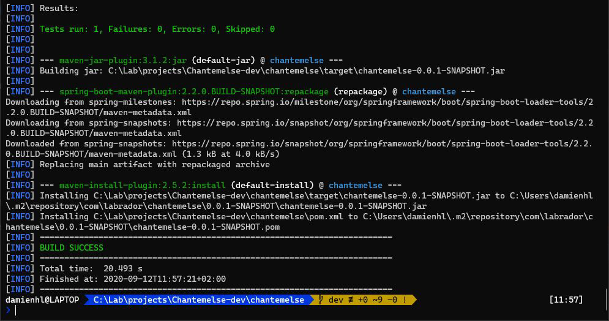
*Figure 5 : Compilation du projet Spring Boot*

La compilation devrait avoir généré plusieurs fichiers, seul un vous intéresse, il se trouve dans le dossier target et se nomme `<nom_du_projet>-0.0.1-SNAPSHOT.jar` (Figure 6)

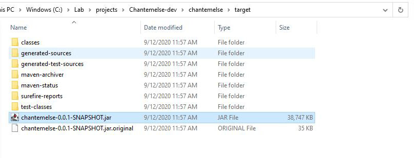
*Figure 6 : Contenu du projet compilé, le fichier qui nous intéresse ici est `chantemelse-0.0.1-SNAPSHOT.jar`*

## Envoi des fichiers

Vous disposez de 2 choix pour envoyer vos fichiers, soit via un client SFTP disposant d'une interface graphique comme FileZilla ou bien en ligne de commande avec SCP.

### Avec FileZilla - interface graphique

Commencez par vous connecter à votre serveur, pour cela dans FileZilla, allez dans `File > Site Manager`, cliquez sur `New Site` et donnez-lui un nom.

Entrez les identifiants de connexion au serveur, si vous vous connectez au serveur par mot de passe, choisissez `Logon Type > Normal` (Figure 7)


*Figure 7 : Connexion par mot de passe*

En revanche, si vous vous connectez au serveur avec votre clé SSH, choisissez `Logon Type > Key file` et choisissez votre clé privée `id_rsa`. (Figure 8)
Vous aurez peut-être besoin de passer le filtres des extensions à `All files` pour voir le fichier.


*Figure 8 : Connexion par SSH*

Si tout se passe bien, FileZilla vous demandera si vous souhaitez ajouter la clé du serveur à la liste des hôtes connus, cliquez sur `yes`.

Sur la gauche se trouve l'arborescence de votre disque local et à droite celle de votre serveur.
Sur votre arborescence locale, naviguez jusqu'au dossier contenant les fichiers du build d'Angular.
Sur l'arborescence du serveur, naviguez jusqu'au dossier qui contiendra votre projet front `front`.

Glissez-déposez les fichiers du build dans le dossier `front` de votre serveur (Figure 9)

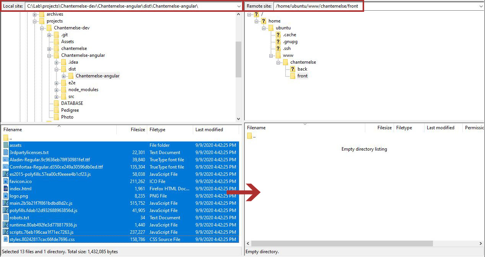
*Figure 9 : À gauche, votre disque local, à droite celle du serveur*

Assurez-vous que les transferts se sont bien effectués (Figure 10)

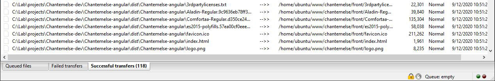
*Figure 10 : Tous les fichiers sont bien transférés*

Répétez la même opération pour le fichier .jar du back.
Sur l'arborescence locale, naviguez jusqu'au dossier contenant le fichier jar généré par Spring Boot.
Sur l'arborescence du serveur, naviguez jusqu'au dossier qui contiendra votre projet back `back`.

Glissez-déposez le fichier jar dans le dossier `back` de votre serveur (Figure 11)

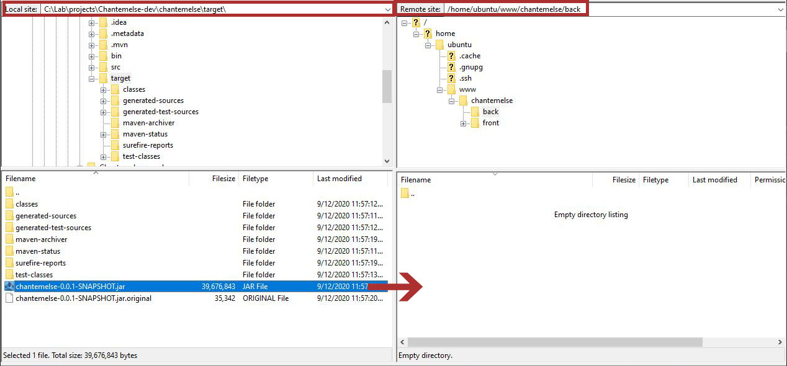
*Figure 11 : Glissez le fichier vers sa destination*

### Avec SCP - en ligne de commande

Tout d'abord, vérifiez que SCP est installé sur votre ordinateur
``` bash
scp
``` 

Pour copier le contenu du dossier du front (Figure 12)
``` bash
scp -P 1337 -r <dossier_build_du_projet_front_local> <nom_d_utilisateur>@<IP_du_serveur>:<dossier_du_projet_front_remote>
``` 

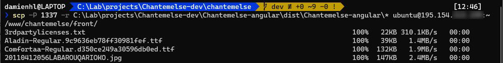
*Figure 12 : Copie SSH du projet front*

<Alert message="Notez ici l'utilisation du drapeau <code>-R</code> pour récursive et de <code>/*</code> après le nom du dossier projet en local pour indiquer de copier l'ensemble des fichiers du dossier et de ses sous-dossiers."/>

Répétez la même opération pour le fichier jar du back.

Pour copier le contenu du dossier du front (Figure 13)
``` bash
scp -P 1337 <fichier_jar_du_projet_back_local> <nom_d_utilisateur>@<IP_du_serveur>:<dossier_du_projet_back_remote>
``` 

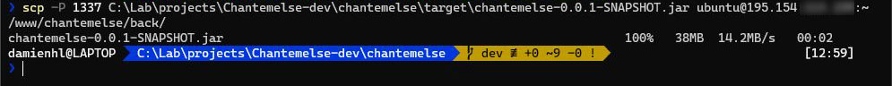
*Figure 13 : Copie SSH du projet back*

## Vérification des fichiers uploadés

Connectez-vous maintenant en SSH au serveur et vérifiez que vos fichiers ont bien été envoyés dans les dossiers `front` et `back` (Figure 14)

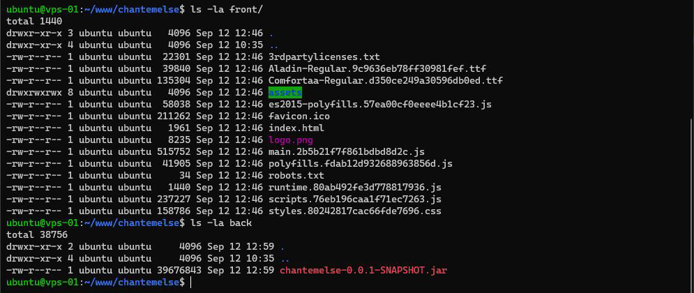
*Figure 14 : Vérification des fichiers*

Vous pouvez lancer le projet back pour voir s'il se lance (Figure 15)
``` bash
java -jar ~/www/<nom_du_projet>/back/<nom_du_fichier>.jar
``` 

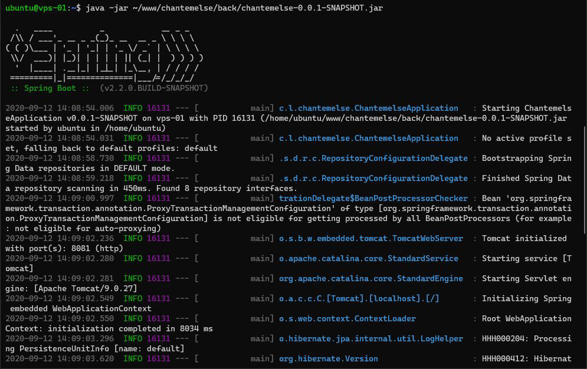
*Figure 15 : Lancement du projet back sur le serveur*

Sur votre navigateur, essayez d'accéder au serveur sur le port du back (ici 8081) soit `http://<IP_du_serveur>:8081` (Figure 16)

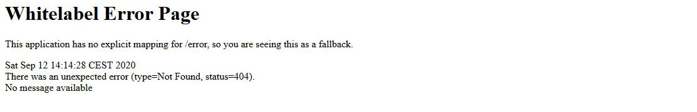
*Figure 16 : Page d'erreur de Spring Boot*

Arrêtez-le ensuite avec `CTRL + C`. Dans le prochain chapitre, vous allez créer un service pour le lancer automatiquement.
