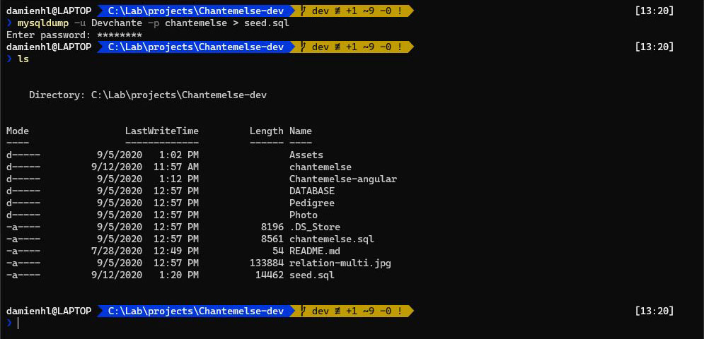
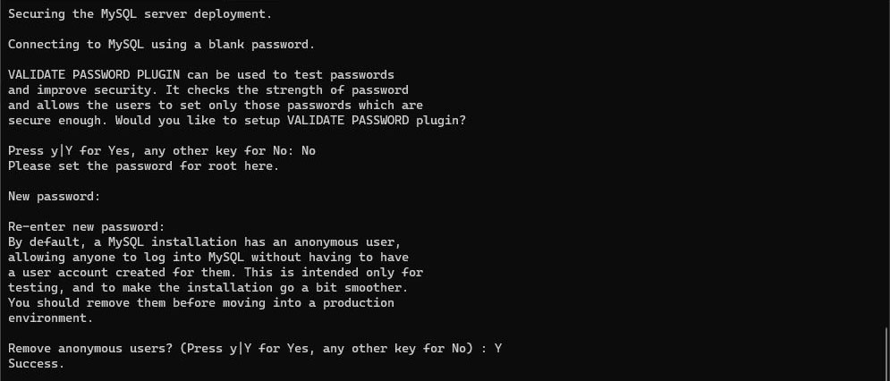
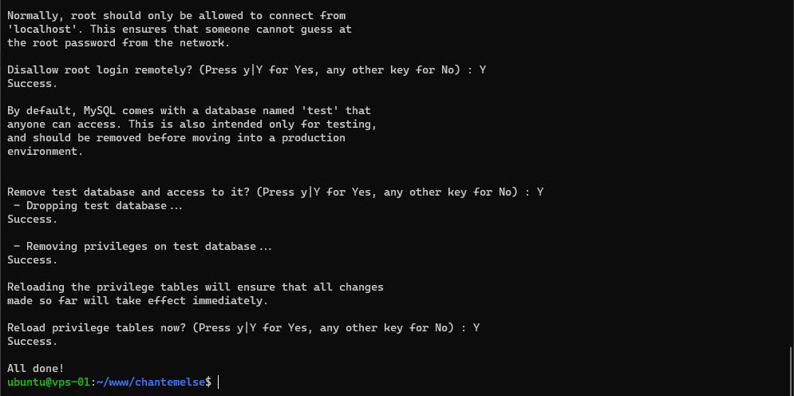
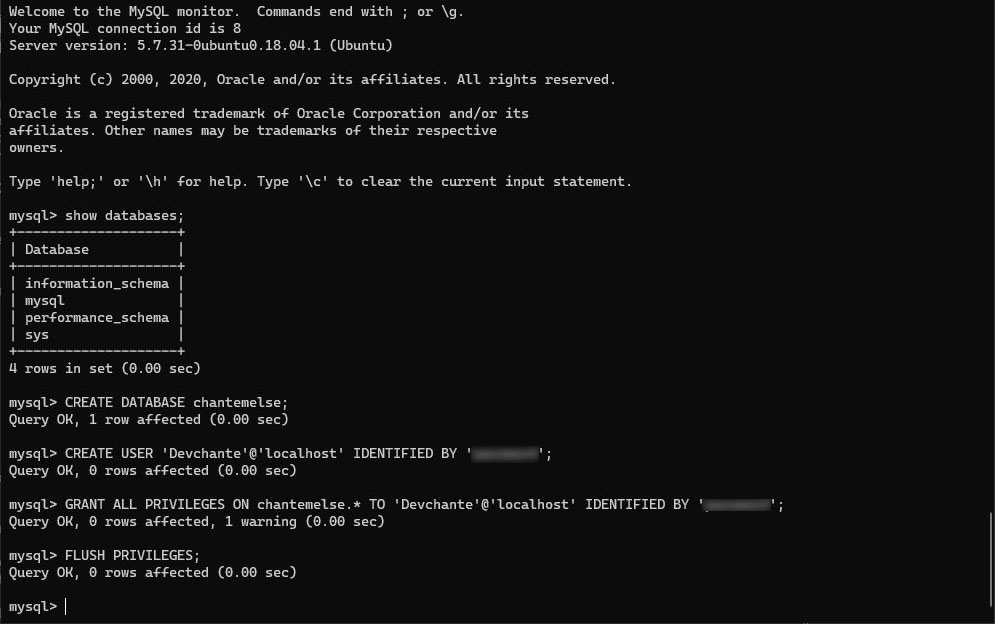
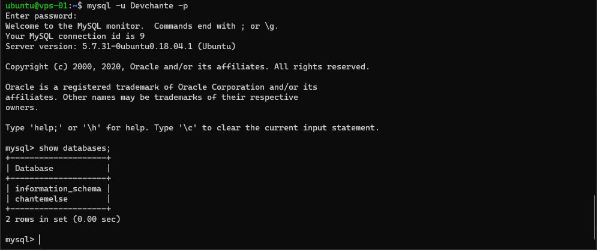

# Base de données MySQL

## Sauvegarde de la base de données locale

Sur votre ordinateur, sauvegardez votre base de données locale pour pouvoir ensuite seeder la base de données de votre serveur
``` bash
mysqldump -u <nom_utilisateur_bbd> -p <nom_de_la_bdd> > seed.sql
```

Cela va vous créer un fichier `seed.sql` dans le répertoire où vous vous trouver (Figure 1)


*Figure 1 : Sauvegarde de la base de données locale*

Envoyez ce fichier sur votre serveur, dans le dossier de l'utilisateur `~/` avec FileZilla ou SCP.

Avec SCP par exemple :
``` bash
scp -P 1337 ./seed.sql <nom_d_utilisateur>@<IP_du_serveur>:~/
```

## Installation de MySQL Server

Sur le serveur, installez le paquet `mysql-server`
``` bash
sudo apt install mysql-server
```

Une fois l'installation terminée, lancez la configuration du serveur
``` bash
sudo mysql_secure_installation
```

Une série de questions va vous être posées et vous allez définir le mot de passe pour l'utilisateur `root` (Figure 2 & Figure 3)
``` bash
Setup VALIDATE PASSWORD PLUGIN? No
Remove Anonymous users? Yes
Disallow root login remotely? Yes
Remove test database and access to it? Yes
Reload privilege table now? Yes
```


*Figure 2 : Série de questions*


*Figure 3 : Série de questions*

## Configuration de MySQL Server

Connectez-vous à MySQL
``` bash
sudo mysql
```

Créez une base de données pour votre application, le nom de cette base doit correspondre à celle renseignée dans votre fichier `application.properties` dans Spring Boot
``` sql
CREATE DATABASE <nom_de_la_base>;
```

Ajoutez un nouvel utilisateur dont le nom correspond à celui définit dans votre fichier `application.properties` dans Spring Boot
``` sql
CREATE USER '<nom_utilisateur_bbd>'@'localhost' IDENTIFIED BY 'password_utilisateur_bbd';
```

Accordez toutes les permissions sur la base de données à votre utilisateur (Figure 4)
``` sql
GRANT ALL PRIVILEGES ON <nom_de_la_base>.* TO 'nom_utilisateur_bbd'@'localhost' IDENTIFIED BY 'password_utilisateur_bbd';
```


*Figure 4 : Création d'un utilisateur*

Quittez la session MySQL et reconnectez-vous avec l'utilisateur nouvellement 
``` bash
mysql -u <nom_utilisateur_bbd> -p
```

Affichez les bases de données accessible par cet utilisateur (Figure 5)
``` sql
SHOW DATABASES;
```


*Figure 5 : Bases de données accessibles par cet utilisateur*

Vous pouvez à présent quittez cette session MySQl.
