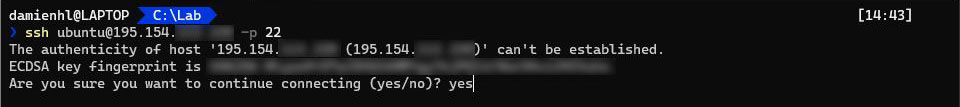
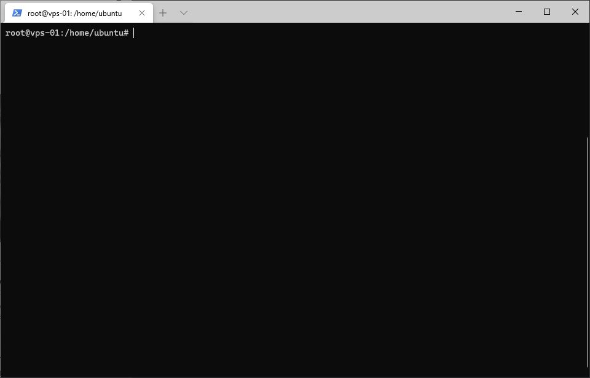

# Premiers pas

## Connexion et mise à jour

Commençons par nous connecter au serveur, pour cela ouvrez votre terminal et tapez la commande suivante :
``` bash
ssh <utilisateur>@<IP_du_serveur> -p 22
```
Entrez `yes` pour indiquer que vous souhaitez continuer la connexion (Figure 1).


*Figure 1: Connexion au serveur via SSH*

Passons en super utilisateur root (vous devrez entrer votre mot de passe) (Figure 2)
``` bash
sudo su
```


*Figure 2: Invite de commande en tant que root*

Mettons à jour les paquets du serveur
``` bash
apt update
apt upgrade
```
