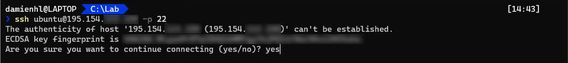

# Premiers pas

## Connexion et mise à jour

Commencez par vous connecter au serveur, pour cela ouvrez votre terminal et tapez la commande suivante :
``` bash
ssh ubuntu@195.154.0.1 -p 22
```
Entrez `yes` pour indiquer que vous souhaitez continuer la connexion (Figure 1).


*Figure 1 : Connexion au serveur via SSH*

Passez en super utilisateur root (vous devrez entrer votre mot de passe) (Figure 2)
``` bash
sudo su
```


*Figure 2 : Invite de commande en tant que root*

Mettez à jour les paquets du serveur
``` bash
apt update
apt upgrade
```
