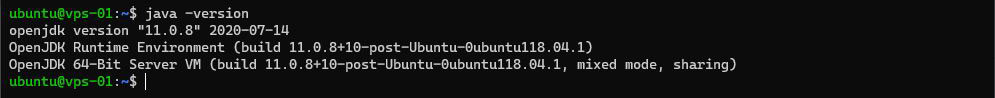
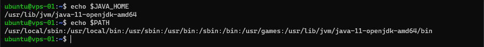

# Java - Partie 1

## Installation

Sur le serveur, installez OpenJDK avec la commande suivante
``` bash
sudo apt install default-jre
```

Vérifiez l'installation (Figure 1)
``` bash
java -version
```


*Figure 1 : Version*

## Configuration

Définissez la variable d'environnement $JAVA_HOME
``` bash
export JAVA_HOME=/usr/lib/jvm/java-11-openjdk-amd64
```

Vérifiez que ce chemin est le bon !

Ajoutez le dossier binaire de Java à la variable d'environnement PATH
``` bash
export PATH=$PATH:$JAVA_HOME/bin
```

Vous pouvez voir la valeur de ces variables avec ces commandes (Figure 2)
``` bash
echo $JAVA_HOME
echo $PATH
```
   

*Figure 2 : Valeur des variables d'environnement $JAVA_HOME et $PATH*
