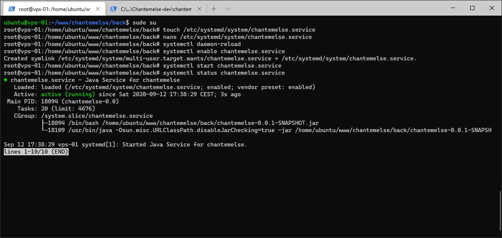

# Java - Partie 2

## Mise en place du service

Passez en super utilisateur `root` et créez le fichier `/etc/systemd/system/<nom_du_projet>.service` :
``` bash
touch /etc/systemd/system/<nom_du_projet>.service
``` 

Modifiez-le à l'aide de nano :
``` bash
nano /etc/systemd/system/<nom_du_projet>.service
``` 

Remplissez ce fichier avec les lignes suivantes (Figure 1) :
``` markup
[Unit]
Description=Java Service for <nom_du_projet>

[Service]
User=ubuntu
ExecStart=/home/ubuntu/www/<nom_du_projet>/back/<nom_du_fichier>.jar
SuccessExitStatus=143
TimeoutStopSec=10
Restart=on-failure
RestartSec=5

[Install]
WantedBy=multi-user.target
```


*Figure 1 : Contenu du service*

Rechargez les services :
``` bash
systemctl daemon-reload
``` 

Activez le service à l'aide de cette commande :
``` bash
systemctl enable <nom_du_projet>.service
``` 

Démarrez-le comme cela :
``` bash
systemctl start <nom_du_projet>.service
``` 

Et vérifiez son statut (Figure 2) :
``` bash
systemctl status <nom_du_projet>.service
``` 


*Figure 2 : Statut du service*

Le back-end devrait maintenant fonctionner !
