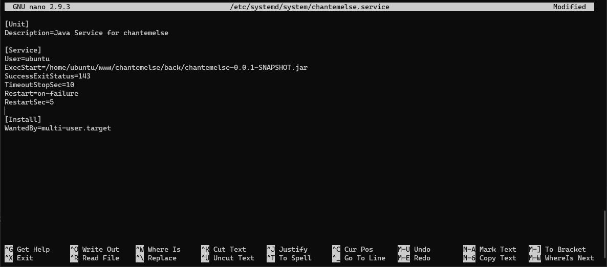
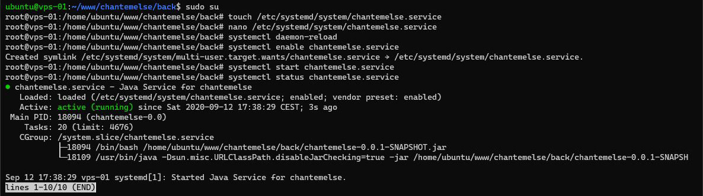

# Java - Partie 2

## Mise en place du service

Donnez à l'utilisateur, les droits d'exécuter le fichier .jar :
``` bash
sudo chmod +x chantemelse-0.0.1-SNAPSHOT.jar
``` 

Passez en super utilisateur `root` et créez le fichier `/etc/systemd/system/chantemelse.service` :
``` bash
touch /etc/systemd/system/chantemelse.service
``` 

Modifiez-le à l'aide de nano :
``` bash
nano /etc/systemd/system/chantemelse.service
``` 

Remplissez ce fichier avec les lignes suivantes (Figure 1) :
``` markup
[Unit]
Description=Java Service for chantemelse

[Service]
User=ubuntu
ExecStart=/home/ubuntu/www/chantemelse/back/chantemelse-0.0.1-SNAPSHOT.jar
SuccessExitStatus=143
TimeoutStopSec=10
Restart=on-failure
RestartSec=5

[Install]
WantedBy=multi-user.target
```


*Figure 1 : Contenu du service*

Rechargez les services :
``` bash
systemctl daemon-reload
``` 

Activez le service à l'aide de cette commande :
``` bash
systemctl enable chantemelse.service
``` 

Démarrez-le comme cela :
``` bash
systemctl start chantemelse.service
``` 

Et vérifiez son statut (Figure 2) :
``` bash
systemctl status chantemelse.service
``` 


*Figure 2 : Statut du service*

Le back-end devrait maintenant fonctionner !
