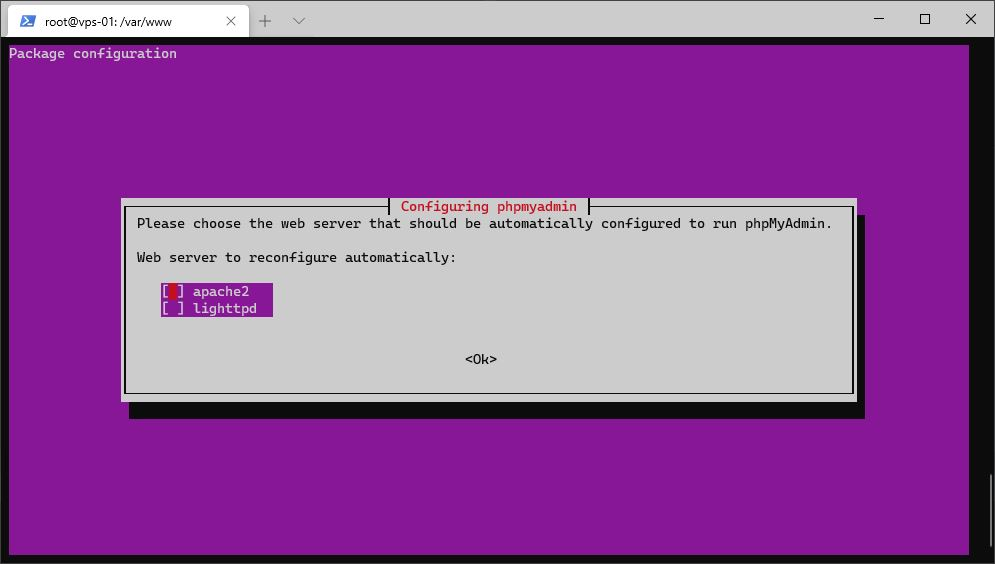
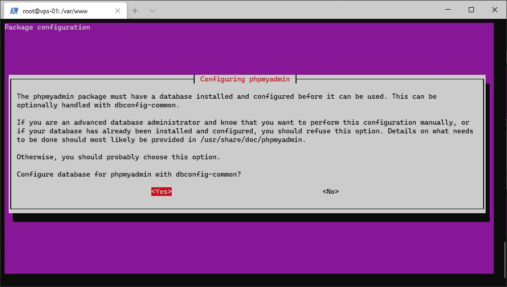

# PHPMyAdmin

## Installation de PHPMyAdmin

Installez PHPMyAdmin à l'aide de la commande suivante *(Figure 1 et Figure 2)* :
``` bash
sudo apt install phpmyadmin php-mbstring php-gettext
``` 

Durant l'installation, il vous sera demandé de choisir le serveur Web à utiliser, opter pour `Apache` *(Figure 1)*. Accepter aussi de configurer automatiquement la base de données utilisée par PHPMyAdmin *(Figure 2)*. 
Enfin choisissez un mot de passe pour vous connecter :


*Figure 1 : Choix du serveur Web*


*Figure 1 : Configuration de la base de données*

## Configuration de PHPMyAdmin

Pour pouvoir accéder à l'interface de PHPMyAdmin, vous allez créer un lien symbolique de celui-ci dans votre répertoire `front` :
``` bash
sudo ln -s /usr/share/phpmyadmin /home/<nom_utilisateur>/www/<nom_du_projet>/front
``` 

Une fois cela fait, ouvrez votre navigateur, entrez l'URL de votre site suivi de `/phpmyadmin` cela devrait vous diriger vers l'interface de PHPMyAdmin.
