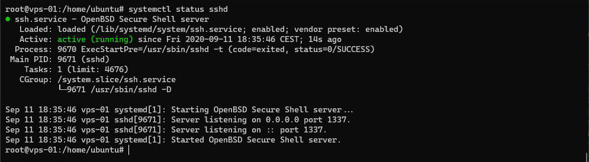

# Sécurité

## Sudo

Afin qu'il ait plus de pouvoir, ajoutons notre utilisateur au groupe `sudo`
``` bash
usermod -aG sudo <utilisateur>
```

## Configurer SSH

Par défaut SSH utilise le port 22, changeons ce port afin d'ajouter une fine couche de sécurité.
Ouvrez le fichier `/etc/ssh/sshd_config` avec nano par exemple :
``` bash
nano /etc/ssh/sshd_config
```
Dé-commentez et changez la ligne définissant le port à utiliser pour par exemple 1337, 5555 ou 1234
``` {7}
[...]
# The strategy used for options in the default sshd_config shipped with
# OpenSSH is to specify options with their default value where
# possible, but leave them commented.  Uncommented options override the
# default value.

Port 1337
#AddressFamily any
#ListenAddress 0.0.0.0
#ListenAddress ::
[...]
```
Refusez la connexion à root en dé-commentant et en modifiant la ligne `PermitRootLogin`
``` {5}
[...]
# Authentication:

#LoginGraceTime 2m
PermitRootLogin no
#StrictModes yes
#MaxAuthTries 6
#MaxSessions 10
[...]
```
Quittez et sauvegardez avec `CTRL + X`

Redémarrez le service SSH
``` bash
systemctl restart sshd
```
Vérifiez le statut du service (Figure 1)
``` bash
systemctl status sshd
```


*Figure 1 : Statut du service SSH*

<Alert message="Vérifier bien votre configuration SSH avant de vous déconnecter du serveur !"/>

Vous pouvez à présent vous déconnectez du serveur et vous reconnectez avec le nouveau port pour vérifier que cela fonctionne correctement
``` bash
ssh <utilisateur>@<IP_du_serveur> -p 1337
```

## Authentification par clé SSH - *Facultatif*

Pour plus de sécurité, il est possible de se connecter uniquement via sa clé SSH et de désactiver la possibilité de se connecter par mot de passe.

Fermez la connexion SSH
``` bash
exit
```

Pour copier le fichier de votre clé publique SSH sur le serveur,
``` bash
 scp -P 1337 ~\.ssh\id_rsa.pub <utilisateur>@<IP_du_serveur>:~
```

Le fichier devrait se retrouver sur le serveur, dans le dossier de l'utilisateur, soit `/home/<utilisateur>/id_rsa.pub` (Figure 2)


*Figure 2 : Fichier de la clé publique SSH*

Ajoutez cette clé à la liste des clés autorisées à se connecter au serveur
``` bash
cat ~/id_rsa.pub >> ~/.ssh/authorized_keys
```

Si vous obtenez le message suivant `-bash: /home/ubuntu/.ssh/authorized_keys: No such file or directory`, créez un dossier `.ssh` et relancer la commande.

Maintenant que la clé est ajoutée, vous pouvez supprimer le fichier `id_rsa.pub`
```
rm  ~/id_rsa.pub
```
Repassez en super utilisateur root
``` bash
sudo su
```

Ouvrez le fichier `/etc/ssh/sshd_config` et effectuez les changements suivants si nécessaire
``` {4,7,14}
[...]
# Change to yes to enable challenge-response passwords (beware issues with
# some PAM modules and threads)
ChallengeResponseAuthentication no
[...]
# To disable tunneled clear text passwords, change to no here!
PasswordAuthentication no
#PermitEmptyPasswords no
# PAM authentication via ChallengeResponseAuthentication may bypass
# the setting of "PermitRootLogin without-password".
# If you just want the PAM account and session checks to run without
# PAM authentication, then enable this but set PasswordAuthentication
# and ChallengeResponseAuthentication to 'no'.
UsePAM no
[...]
```

Quittez, sauvegardez, relancez et vérifier l'état du service.

## Configuration du pare-feu

Autorisez et limitez l’accès au port SSH (adaptez par rapport au port que vous avez choisi)
``` bash
ufw limit 1337/tcp
```

Autorisez l’accès aux ports HTTP (port TCP 80) et HTTPS (port TCP 443)
``` bash
ufw allow 80/tcp
ufw allow 443/tcp
```

Autorisez l’accès au port du projet back (port 8081 pour l'exemple)
``` bash
ufw allow 8081/tcp
```

Activez le pare feu
``` bash
ufw enable
```

Vérifiez le statut du pare feu
``` bash
ufw status
```

## Bloquer le trafic entrant - *Facultatif*

Vous pouvez bloquer le trafic entrant par défaut et autoriser le trafic sortant par défaut
``` bash
ufw default deny incoming
ufw default allow outgoing
```

C'est tout niveau sécurité pour le moment.
