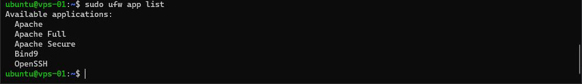
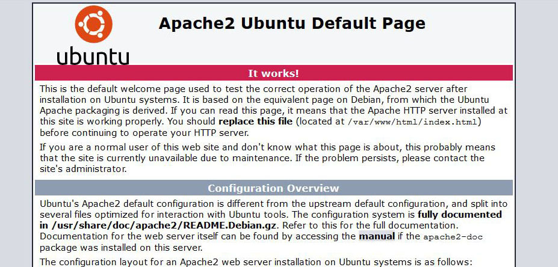

# Serveur Web Apache - Partie 1

## Installation d'Apache

Vous allez installer Apache, il va nous servir gérer les requêtes HTTP et servir ainsi votre projet.

Si ce n'est déjà fait, quitter le mode super utilisateur.

Installez Apache en lançant cette commande
``` bash
sudo apt install apache2
```

Pendant l'installation, Apache ajoute ses propres règles au pare-feu, vous pouvez voir qu'elles sont bien en place grâce à cette commande
``` bash
sudo ufw app list
```


*Figure 1 : 3 règles ajoutées par Apache*

Vérifiez maintenant si Apache s'est lancé
``` bash
sudo systemctl status apache2
```

Si ce n'est pas le cas, lancez-le à l'aide de la commande suivante
``` bash
sudo systemctl start apache2
```

Ouvrez votre navigateur et entrez-y l'adresse IP du serveur, si tout s'est bien passé, vous devriez voir la page par défaut d'Apache


*Figure 2 : Page par défaut d'Apache*
