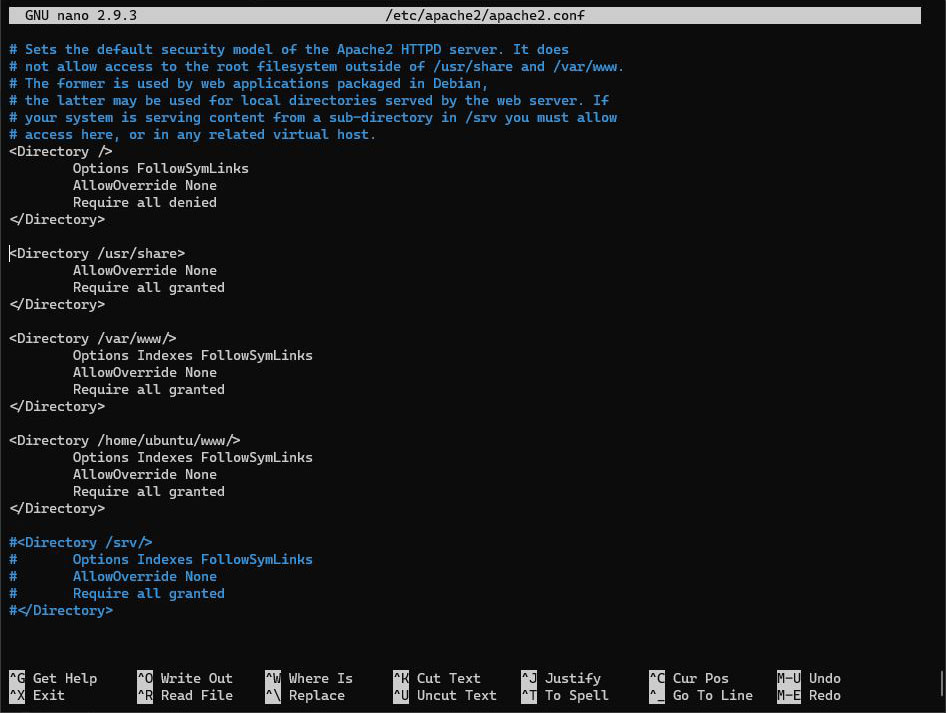
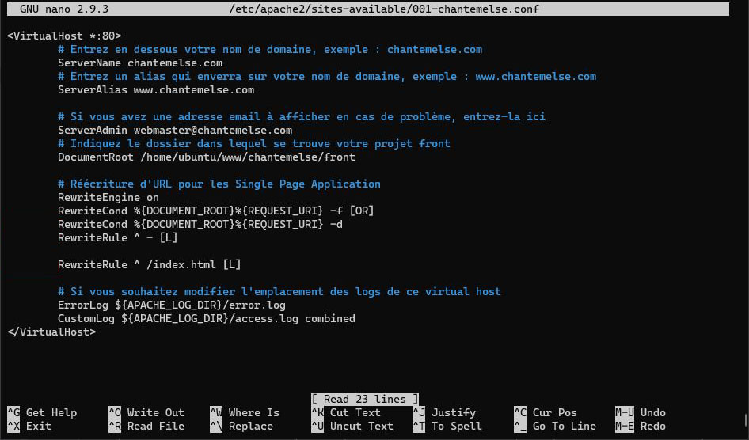

# Serveur Web Apache - Partie 2

## Configuration d'Apache

Avant de configurer spécifiquement le projet, il est nécessaire d'effectuer quelques modifications à la configuration d'Apache.

Tout d'abord, sur votre serveur, passez en super utilisateur `root` et activez le module `rewrite` d'Apache :
``` bash
a2enmod rewrite
``` 

Ajoutez maintenant le dossier `/home/<nom_utilisateur>/www` dans la liste des dossiers gérés par Apache (Figure 2) 
Pour cela, ouvrez le fichier `/etc/apache2/apache2.conf` et modifiez les lignes indiquées :
``` bash{24-28}
# Sets the default security model of the Apache2 HTTPD server. It does
# not allow access to the root filesystem outside of /usr/share and /var/www.
# The former is used by web applications packaged in Debian,
# the latter may be used for local directories served by the web server. If
# your system is serving content from a sub-directory in /srv you must allow
# access here, or in any related virtual host.
<Directory />
        Options FollowSymLinks
        AllowOverride None
        Require all denied
</Directory>

<Directory /usr/share>
        AllowOverride None
        Require all granted
</Directory>

<Directory /var/www/>
        Options Indexes FollowSymLinks
        AllowOverride None
        Require all granted
</Directory>

<Directory /home/<nom_utilisateur>/www/>
        Options Indexes FollowSymLinks
        AllowOverride None
        Require all granted
</Directory>

#<Directory /srv/>
#       Options Indexes FollowSymLinks
#       AllowOverride None
#       Require all granted
#</Directory>
```


*Figure 2 : Liste des dossiers gérés par Apache*

Redémarrez le service Apache 
``` bash
systemctl restart apache2
``` 

Vous allez maintenant créer un virtual host pour votre projet.

Copiez la configuration du site par défaut d'Apache, nommez-la `001-<nom_du_projet>`
``` bash
cp /etc/apache2/sites-available/000-default.conf /etc/apache2/sites-available/001-<nom_du_projet>.conf
``` 

Éditez ce fichier avec nano
``` bash
nano /etc/apache2/sites-available/001-<nom_du_projet>.conf
``` 

Modifiez-le comme ceci (Figure 1)
``` markup
<VirtualHost *:80>
        # Entrez en dessous votre nom de domaine, exemple : chantemelse.com
        ServerName chantemelse.com 
        # Entrez un alias qui enverra sur votre nom de domaine, exemple : www.chantemelse.com
        ServerAlias www.chantemelse.com
        
        # Si vous avez une adresse email à afficher en cas de problème, entrez-la ici
        ServerAdmin webmaster@chantemelse.com  
        # Indiquez le dossier dans lequel se trouve votre projet front
        DocumentRoot /home/ubuntu/www/chantemelse/front

        # Réécriture d'URL pour les Single Page Application
        RewriteEngine on
        RewriteCond %{REQUEST_FILENAME} -s [OR]
        RewriteCond %{REQUEST_FILENAME} -l [OR]
        RewriteCond %{REQUEST_FILENAME} -d
        RewriteRule ^.*$ - [NC,L]
        
        RewriteRule ^(.*) /index.html [NC,L]

        # Si vous souhaitez modifier l'emplacement des logs de ce virtual host
        ErrorLog ${APACHE_LOG_DIR}/error.log
        CustomLog ${APACHE_LOG_DIR}/access.log combined
</VirtualHost>
``` 


*Figure 1 : Configuration du virtual host du projet*

Sauvegardez et testez cette configuration, s'il y a des erreurs de syntaxe, celles-ci seront indiquées
``` bash
apachectl configtest
``` 


Désactivez le site par défaut et activez votre projet
``` bash
a2disite 000-default.conf
a2ensite 001-chantemelse.conf
``` 

Rechargez maintenant le service Apache 
``` bash
systemctl reload apache2
``` 

Ouvrez votre navigateur et entrez l'adresse IP du serveur, le site devrait s'afficher.
