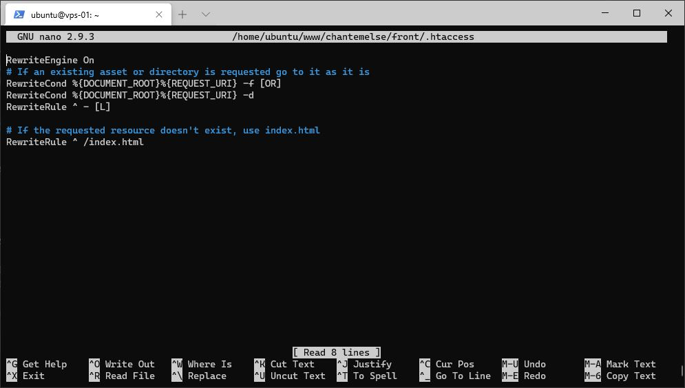

# Serveur Web Apache - Partie 2

## Configuration d'Apache

Avant de configurer spécifiquement le projet, il est nécessaire d'effectuer quelques modifications à la configuration d'Apache.

Tout d'abord, sur votre serveur, passez en super utilisateur `root` et activez le module `rewrite` d'Apache :
``` bash
a2enmod rewrite
``` 

Créez un lien symbolique du projet front dans le dossier `/var/www` :
``` bash
ln -s /home/ubuntu/www/chantemelse/front /var/www/chantemelse
``` 

Redémarrez le service Apache 
``` bash
systemctl restart apache2
``` 

Vous allez maintenant créer un virtual host pour votre projet.

Copiez la configuration du site par défaut d'Apache, nommez-la `001-chantemelse`
``` bash
cp /etc/apache2/sites-available/000-default.conf /etc/apache2/sites-available/001-chantemelse.conf
``` 

Éditez ce fichier avec nano
``` bash
nano /etc/apache2/sites-available/001-chantemelse.conf
``` 

Modifiez-le comme ceci (Figure 1)
``` markup
<VirtualHost *:80>
        # Entrez en dessous votre nom de domaine, exemple : chantemelse.com
        ServerName chantemelse.com 
        # Entrez un alias qui enverra sur votre nom de domaine, exemple : www.chantemelse.com
        ServerAlias www.chantemelse.com
        
        # Si vous avez une adresse email à afficher en cas de problème, entrez-la ici
        ServerAdmin webmaster@chantemelse.com  
        # Indiquez le dossier dans lequel se trouve votre projet front
        DocumentRoot /var/www/chantemelse

        # Changement du comportement d'Apache pour le répertoire
        <Directory /var/www/chantemelse>
            Options -Indexes
            AllowOverride all
        </Directory>

        # Si vous souhaitez modifier l'emplacement des logs de ce virtual host
        ErrorLog ${APACHE_LOG_DIR}/error.log
        CustomLog ${APACHE_LOG_DIR}/access.log combined
</VirtualHost>
``` 


*Figure 1 : Configuration du virtual host du projet*

Sauvegardez et testez cette configuration, s'il y a des erreurs de syntaxe, celles-ci seront indiquées
``` bash
apachectl configtest
``` 

Désactivez le site par défaut et activez votre projet
``` bash
a2disite 000-default.conf
a2ensite 001-chantemelse.conf
``` 

Rechargez maintenant le service Apache 
``` bash
systemctl reload apache2
``` 

Le projet front étant une application SPA `Single Page Application`, il peut être nécessaire de faire appel à la réécriture d'URL d'Apache via un fichier `.htaccess` pour que les routes définies dans l'application soient appelées correctement.
Pour cela, quittez d'abord le mode super utilisateur. 

Créez un fichier `.htaccess` dans `/home/ubuntu/www/chantemelse/front`.

Éditez ce fichier avec nano comme cela (Figure 2)
```
RewriteEngine On
RewriteCond %{DOCUMENT_ROOT}%{REQUEST_URI} -f [OR]
RewriteCond %{DOCUMENT_ROOT}%{REQUEST_URI} -d
RewriteRule ^ - [L]

RewriteRule ^ /index.html
``` 


*Figure 2 : Fichier .htaccess*

Ouvrez votre navigateur et entrez l'adresse IP du serveur, le site devrait s'afficher.
